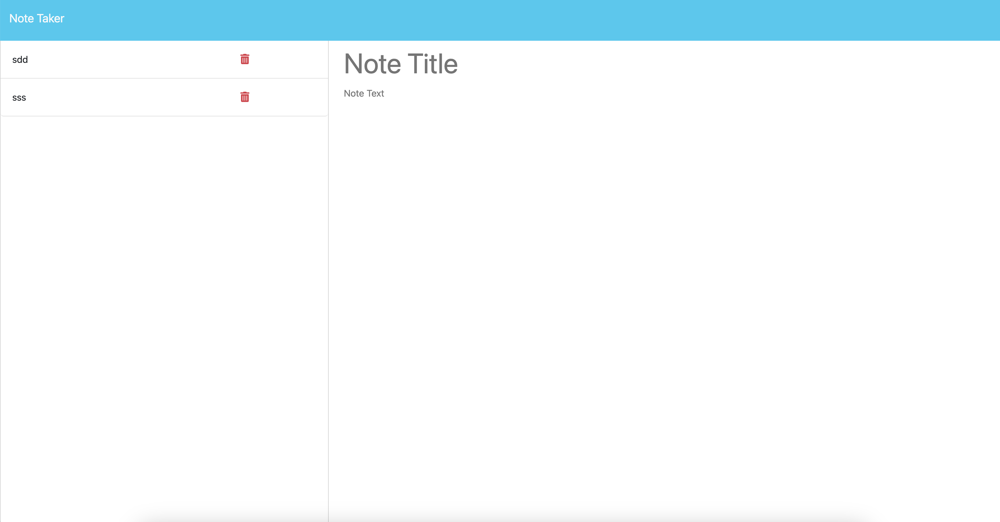
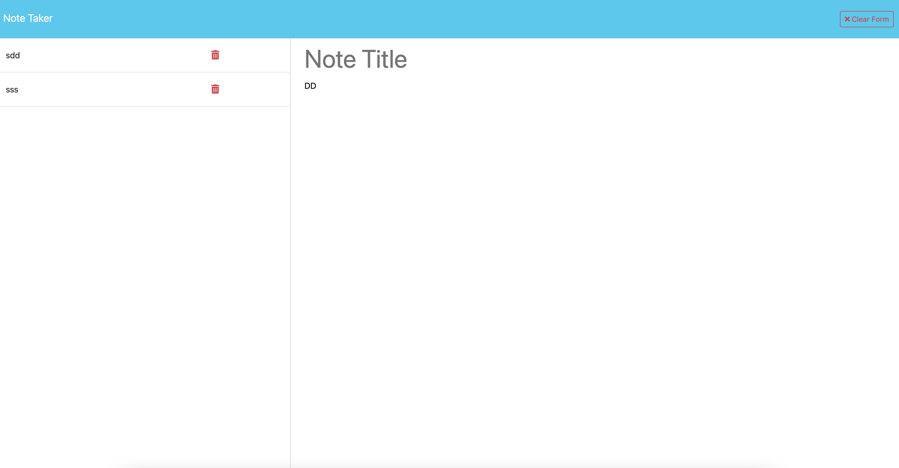
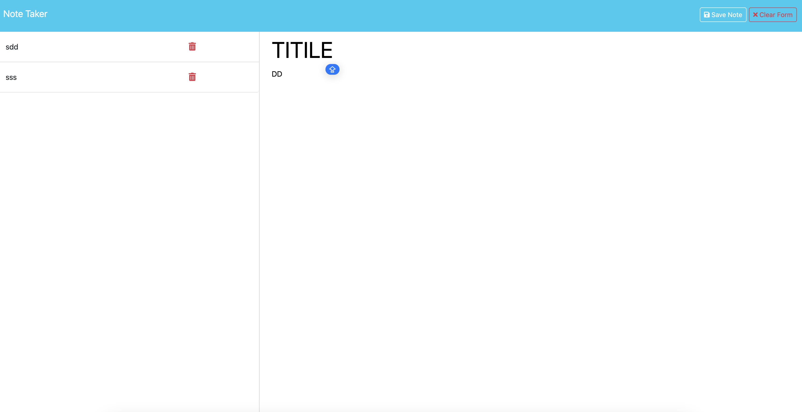

# Note taker

## Description
 This is a note taking application that deletes, calls, and inputs new notes.

 Link to repo: https://github.com/jonghoBae0218/note_taker

 Link to application: https://note-taker-1gaj.onrender.com/

## Features

1. Calling notes from database so that user can call their notes with any device. 
2. Dynamically controls new note, clear form, and save note buttons.

## Using instructions
1. Click Get Started to navigate to note section.

2. Left column shows previously taken notes. Click them to call the note, press trashcan to delete the note.

3. By typing either title or note, clear note button will show up on top right.

4. By typing both title and note field, you will be able to save the note.

## Questions
Github Repo: [jonghoBae0218](https://github.com/jonghoBae0218)

Please reach out via E-mail on: jb4918@columbia.edu 